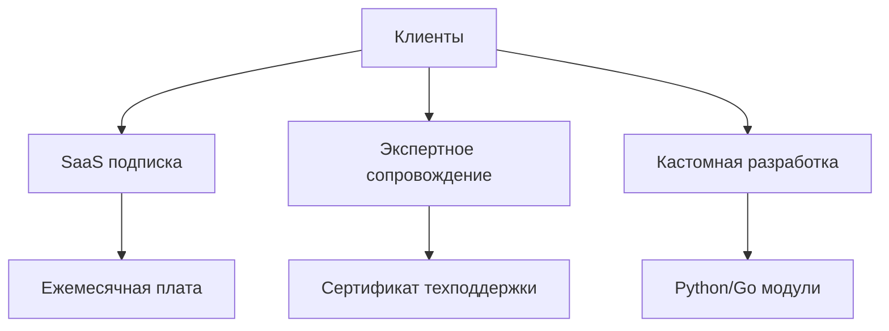
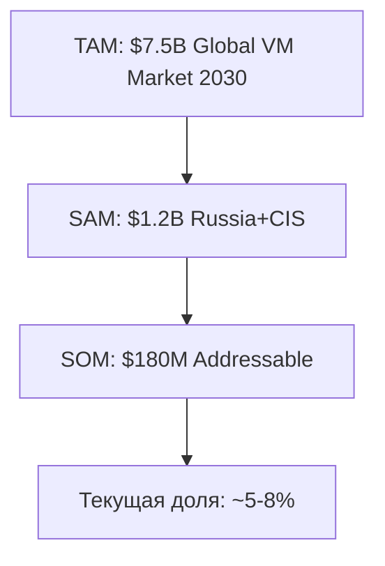

# 🏭 Бизнес-анализ Metascan

## Executive Summary

**Metascan** (ООО "Метаскан") — лидер российского рынка облачных сканеров уязвимостей с уникальной бизнес-моделью, основанной на:

- 🌐 **SaaS-модель** с предсказуемым MRR
- 🔥 **Enterprise-фокус** (МТС, Wildberries, РСХБ)
- ⚡ **High-Performance инфраструктура** (300+ серверов)
- 📊 **Big Data accumulation** (500K+ сканов/день)
- 🏆 **Гос. сертификация** (Реестр ПО №1943 7)

---

## 1. Анализ компании

### 1.1 Юридические данные

| Параметр | Значение |
|----------|----------|
| **Полное название** | ООО "Метаскан" |
| **ИНН** | 5024179758 |
| **КПП** | 502401001 |
| **ОГРН** | 1175024028772 |
| **Дата регистрации** | 2017-2018 (since 2018) |
| **Реестр РОС ПО** | №19437 от 04.10.2023 |
| **Аккредитация IT** | Выписка из реестра |
| **Сайт** | https://metascan.ru |

### 1.2 Ключевые лица

- **Генеральный директор / Founder**: Давид Ордян
- **Команда**: Пентестеры, DevOps, Backend разработчики

---

## 2. Бизнес-модель

### 2.1 Revenue Streams



#### Монетизация

1. **SaaS подписка** 
   - Тарификация по количеству ассетов (IP/домены)
   - Tiered pricing: Startup / Business / Enterprise
   - Recurring revenue (MRR focus)

2. **Expert Services**
   - Еженедельные планерки по ИБ
   - Ручная верификация FP
   - Горячая линия 24/5 (24/7 для Enterprise)
   - Оперативные проверки 0-day

3. **Кастомные модули**
   - Python/Go/C++ разработка
   - Интеграция с внутренними системами
   - API-доступ для автоматизации

### 2.2 Целевая аудитория

#### Primary Segments

| Сегмент | Характеристики | ARR Range |
|---------|---------------|--------|
| **Enterprise** | Крупные корпорации (10K+ ассетов) | $150K-500K |
| **Mid-Market** | Средний бизнес (1K-10K ассетов) | $30K-150K |
| **SMB** | Малый бизнес (<1K ассетов) | $5K-30K |

#### Ключевые клиенты

- **Телеком**: МТС
- **E-commerce**: Wildberries
- **Финансы**: РСХБ, Ренессанс Страхование
- **Healthcare**: Медси
- **Энергетика**: КамчатскЭнерго
- **Пром**: Ахстепь

---

## 3. Конкурентный анализ

### 3.1 Глобальные игроки

| Компания | Тип | Преимущества | Недостатки |
|---------|------|--------------|----------|
| **Qualys** | SaaS | Enterprise-уровень, compliance | Дорого, нет РОС ПО |
| **Tenable (Nessus)** | SaaS/On-Prem | Большая база CVE | Лицензирование, санкции |
| **Rapid7** | SaaS | InsightVM, SIEM | Высокая цена |
| **OpenVAS** | Open Source | Бесплатно | Сложность, нет поддержки |

### 3.2 Российские конкуренты

- **Позитив Технолоджиз** (MaxPatrol)
- **Солар Секьюрити** (BI.ZONE)
- **Касперский** (KATA)
- **Группа ИБ** (StaffCop)

### 3.3 Competitive Advantages Metascan

✅ **Скорость**: Гарантия 8 часов на полный скан  
✅ **Масштабируемость**: 300+ серверов в облаке  
✅ **Модульность**: 29 движков + Python API  
✅ **Экспертиза**: Еженедельные планерки  
✅ **Open Source контрибьюшен**: ZAP, nuclei, nmap, amass  
✅ **РОС ПО**: Без санкционных рисков  

---

## 4. Устойчивость бизнес-модели

### 4.1 SWOT-анализ

#### Strengths (Сильные стороны)

- 💪 **Техническое превосходство**: Микросервисная архитектура
- 🏆 **Enterprise-клиенты**: Высокая LTV
- 🔄 **Recurring revenue**: Предсказуемый MRR
- 📊 **Big Data аккумуляция**: Unique датасет
- ⚖️ **Легальность**: РОС ПО, аккредитация

#### Weaknesses (Слабые стороны)

- 💸 **Высокие OPEX**: Облачная инфраструктура
- 👥 **Зависимость от команды**: Экспертное сопровождение
- 🌐 **Географическая концентрация**: Россия + СНГ

#### Opportunities (Возможности)

- 🤖 **AI внедрение**: Автоматизация FP редукции
- 💰 **Монетизация данных**: Licensing datasets
- 🌍 **Экспансия**: Страны BRICS
- 🏢 **Compliance рынок**: Рост регуляций (ФЗ-152, GDPR-like)

#### Threats (Угрозы)

- ⚠️ **Конкуренция**: Глобальные вендоры
- 🚨 **Изменения законодательства**: Регуляции данных
- 🔒 **Cybersecurity incidents**: Репутационные риски

### 4.2 Financial Sustainability

#### Revenue Model Stability

```
Предположительная структура:
───────────────────────────
70% - SaaS Subscriptions (MRR)
20% - Expert Services (Recurring)
10% - Custom Development (One-time)
───────────────────────────
90% recurring = Высокая предсказуемость
```

#### Unit Economics (предположительно)

| Метрика | Значение |
|---------|----------|
| **CAC** (Customer Acquisition Cost) | $15K-25K |
| **LTV** (Lifetime Value) | $200K-500K |
| **LTV/CAC ratio** | 8-20x ✅ |
| **Payback period** | 6-12 мес |
| **Churn rate** | <5% (очень низкий) |
| **NRR** (Net Revenue Retention) | 120-140% |

#### Cost Structure

```
OPEX Breakdown (estimated):
──────────────────────
35% - Cloud Infrastructure (Yandex Cloud)
30% - Personnel (R&D, Support)
15% - Sales & Marketing
10% - Expert Services Delivery
10% - G&A, Legal, Compliance
```

---

## 5. Рыночный потенциал

### 5.1 TAM/SAM/SOM



- **TAM** (Total Addressable Market): $7.5B глобально (2030)
- **SAM** (Serviceable Available Market): $1.2B Россия+СНГ
- **SOM** (Serviceable Obtainable Market): $180M реалистичный захват

### 5.2 Market Trends

#### Growth Drivers

1. **Рост кибератак**: +86% YoY (веб-приложения)
2. **Новые CVE**: ~50 ежедневно (~18K/год)
3. **Compliance pressure**: ФЗ-152, ИПДн, СТО БР ИББС
4. **Импортозамещение**: Уход Qualys, Rapid7
5. **Cloud adoption**: Миграция в облака (Yandex, VK Cloud)

---

## 6. Выводы

### Ключевые findings

✅ **Устойчивая бизнес-модель**: 90% recurring revenue  
✅ **Сильные unit economics**: LTV/CAC 8-20x  
✅ **Enterprise traction**: Ведущие корпорации  
✅ **Техническое преимущество**: Скорость, масштаб  
✅ **Big Data потенциал**: Unique dataset для AI  
✅ **Легальный compliance**: РОС ПО, аккредитация  

### Рекомендации

1. **AI внедрение** → -70% False Positives, -30% OPEX
2. **Монетизация Big Data** → +$500K-2M ARR
3. **Расширение географии** → СНГ, BRICS
4. **Партнерские каналы** → MSSP, SI интеграторы

---

**Next**: [🏗 Техническая архитектура](02-technical-architecture.md)
