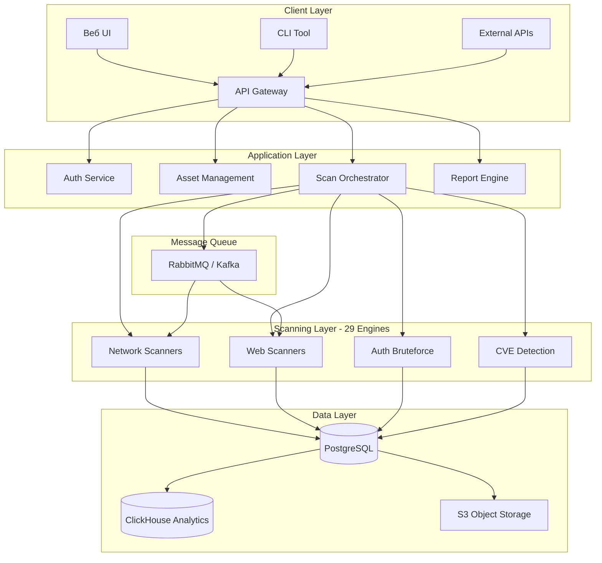
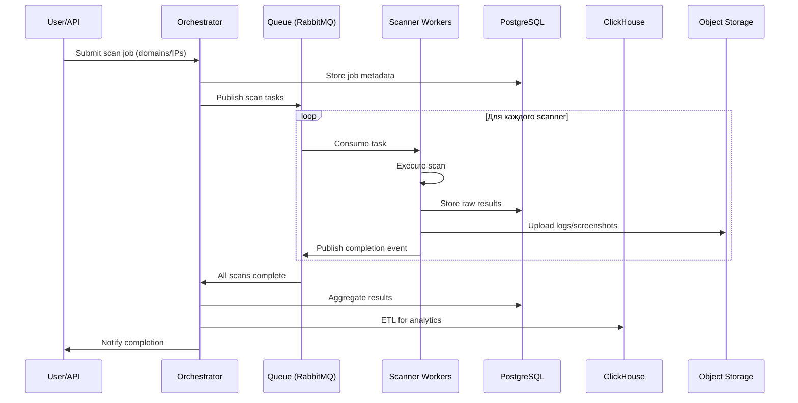
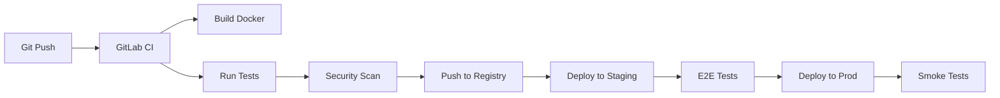

# 🏗 Техническая архитектура Metascan

## Executive Summary

**Metascan** представляет собой **distributed microservices-based cloud platform** для непрерывного сканирования уязвимостей с архитектурой, оптимизированной для:

- ⚡ **High Throughput**: 500K+ ассетов/день
- 📏 **Horizontal Scaling**: 300+ compute nodes
- 🔄 **Event-Driven**: Асинхронная обработка
- 🛡️ **Fault-Tolerant**: Auto-recovery, circuit breakers
- 📊 **Observable**: Full-stack monitoring

---

## 1. High-Level архитектура

### 1.1 System Overview



### 1.2 Ключевые компоненты

#### Frontend Layer

- **Web UI**: React/Vue.js SPA
- **API Gateway**: Kong / NGINX (rate limiting, auth)
- **CLI Tool**: Python-based scanner client

#### Application Services

| Service | Технология | Назначение |
|---------|-----------|----------|
| **Auth Service** | Go + JWT | Аутентификация, RBAC |
| **Asset Manager** | Python/Django | Управление IP/доменами |
| **Scan Orchestrator** | Python/Celery | Оркестрация сканов |
| **Report Engine** | Python + Jinja2 | Генерация PDF/HTML отчетов |
| **Notification Service** | Go | Email/Slack/Telegram алерты |

#### Scanning Engines (29 модулей)

**Network Layer**:
- `nmap` - Port scanning (0-65535)
- `masscan` - High-speed SYN scanning
- `amass` - Subdomain enumeration
- `dnsx` - DNS resolution

**Web Application Layer**:
- `nuclei` - Template-based CVE detection
- `katana` - Web crawler
- `httpx` - HTTP probing
- `ZAP (OWASP)` - DAST scanning
- `dirsearch` - Directory bruteforce
- `wafw00f` - WAF fingerprinting
- `magescan` - CMS vulnerability detection

**Authentication Layer**:
- `hydra` - Login bruteforce (SSH, FTP, MySQL, etc.)
- Custom brute-force modules

**Vulnerability Detection**:
- `cve-search` - CVE matching
- `vulners` - Vulnerability intelligence
- Custom Python/Go detectors

### 1.3 Data Flow



---

## 2. Технологический стек

### 2.1 Backend

#### Языки программирования

```python
# Core Services Distribution
────────────────────────
60% - Python 3.10+
     • Django / FastAPI
     • Celery workers
     • Scanner integrations
     
30% - Go 1.21+
     • High-performance services
     • Network scanners
     • Real-time processing
     
10% - C/C++
     • Custom probes
     • Performance-critical modules
```

#### Frameworks & Libraries

**Python**:
- `Django 4.x` - Web framework
- `FastAPI` - High-performance APIs
- `Celery` - Distributed task queue
- `SQLAlchemy` - ORM
- `Pydantic` - Data validation
- `aiohttp` - Async HTTP client

**Go**:
- `Gin` - Web framework
- `GORM` - ORM
- `go-redis` - Redis client
- `nats.go` - Message broker client

### 2.2 Infrastructure

#### Cloud Provider: Yandex Cloud

**Compute**:
- **Compute Cloud**: 300+ VMs (s2.medium, s2.large)
- **Instance Groups**: Auto-scaling (10-500 instances)
- **Serverless Containers**: Легкие задачи

**Storage**:
- **Object Storage (S3)**: Логи, скриншоты, raw data
- **Managed PostgreSQL**: Transactional DB (HA cluster)
- **Managed ClickHouse**: Analytics, OLAP

**Networking**:
- **Virtual Private Cloud**: Изоляция сетей
- **Load Balancer**: Application LB + Network LB
- **Cloud DNS**: Управление доменами

**Message Brokers**:
- **RabbitMQ** (текущее) или **Managed Kafka**
- Redis Pub/Sub для real-time events

### 2.3 Orchestration & CI/CD

#### Kubernetes

```yaml
# Cluster Configuration
apiVersion: v1
kind: Cluster
metadata:
  name: metascan-prod
spec:
  nodes:
    - type: master
      count: 3
      flavor: s2.medium (4 vCPU, 16GB RAM)
    - type: worker
      count: 50+
      flavor: s2.large (8 vCPU, 32GB RAM)
      autoscaling:
        min: 10
        max: 500
  
  namespaces:
    - production
    - staging
    - development
```

**Ключевые workloads**:
- `Deployments` - API services
- `StatefulSets` - Databases, message brokers
- `DaemonSets` - Monitoring agents
- `Jobs/CronJobs` - Scheduled scans

#### CI/CD Pipeline



**Tools**:
- **GitLab CI** / GitHub Actions
- **Docker Registry**: Yandex Container Registry
- **Helm**: K8s package manager
- **ArgoCD**: GitOps deployments

---

## 3. Сканирование и обработка

### 3.1 Scan Workflow

```python
# Orchestrator Pseudocode

def orchestrate_scan(asset_list):
    """
    Оркестрация полного скана
    """
    # Phase 1: Discovery
    domains = enumerate_subdomains(asset_list)
    ips = resolve_dns(domains)
    
    # Phase 2: Port Scanning (parallel)
    open_ports = scan_ports(ips, range(0, 65536))
    
    # Phase 3: Service Detection
    services = fingerprint_services(open_ports)
    
    # Phase 4: Vulnerability Detection
    vulnerabilities = []
    for service in services:
        # Запуск 29 движков параллельно
        tasks = [
            nuclei.scan(service),
            zap.scan(service),
            nmap_vuln_scripts(service),
            custom_detectors(service)
        ]
        results = await asyncio.gather(*tasks)
        vulnerabilities.extend(results)
    
    # Phase 5: Validation & Deduplication
    validated = validate_vulnerabilities(vulnerabilities)
    deduplicated = remove_duplicates(validated)
    
    # Phase 6: Prioritization
    prioritized = calculate_risk_scores(deduplicated)
    
    return prioritized
```

### 3.2 Parallelization Strategy

**Уровни параллелизма**:

1. **Уровень ассетов**: 500K ассетов → 500 workers
2. **Уровень сканеров**: 29 движков параллельно
3. **Уровень портов**: Батчи по 1K портов

**Concurrency Control**:
- Rate limiting: Избежание DDoS на target
- Resource limits: CPU/Memory quotas per pod
- Backpressure: Queue depth monitoring

### 3.3 Результаты и хранение

#### Data Schema (PostgreSQL)

```sql
-- Основные таблицы

CREATE TABLE assets (
    id UUID PRIMARY KEY,
    type VARCHAR(20), -- domain, ip, subnet
    value TEXT,
    owner_id UUID,
    created_at TIMESTAMP
);

CREATE TABLE scan_jobs (
    id UUID PRIMARY KEY,
    asset_ids UUID[],
    status VARCHAR(20),
    started_at TIMESTAMP,
    completed_at TIMESTAMP
);

CREATE TABLE vulnerabilities (
    id UUID PRIMARY KEY,
    asset_id UUID REFERENCES assets(id),
    scan_job_id UUID REFERENCES scan_jobs(id),
    cve_id VARCHAR(20),
    cvss_score DECIMAL(3,1),
    severity VARCHAR(10),
    title TEXT,
    description TEXT,
    proof_of_concept TEXT,
    remediation TEXT,
    discovered_at TIMESTAMP,
    validated BOOLEAN DEFAULT FALSE
);

CREATE TABLE scan_results_raw (
    id BIGSERIAL PRIMARY KEY,
    scan_job_id UUID,
    scanner_name VARCHAR(50),
    asset_id UUID,
    raw_output JSONB,
    created_at TIMESTAMP
);
```

#### Analytics (ClickHouse)

```sql
-- OLAP для быстрых агрегаций

CREATE TABLE vulnerability_metrics (
    date Date,
    customer_id UUID,
    asset_id UUID,
    cve_id String,
    severity LowCardinality(String),
    cvss_score Float32,
    scanner_name LowCardinality(String),
    false_positive UInt8
)
ENGINE = MergeTree()
PARTITION BY toYYYYMM(date)
ORDER BY (date, customer_id, asset_id);
```

---

## 4. Observability & Monitoring

### 4.1 Monitoring Stack

```yaml
# Prometheus + Grafana + Loki + Jaeger

Components:
  - Prometheus:
      - Metrics scraping (15s interval)
      - AlertManager integration
      - 30-day retention
  
  - Grafana:
      - Dashboards:
        * System metrics (CPU, RAM, Disk)
        * Application metrics (RPS, latency, errors)
        * Business metrics (scans/day, vulns detected)
      - Alerts: Slack, PagerDuty
  
  - Loki:
      - Centralized log aggregation
      - Log retention: 90 days
  
  - Jaeger:
      - Distributed tracing
      - Span retention: 7 days
```

### 4.2 Ключевые метрики

#### SLIs (Service Level Indicators)

| Метрика | Target | Alert Threshold |
|---------|--------|----------------|
| **API Availability** | 99.9% | <99.5% |
| **API Latency (p95)** | <500ms | >1s |
| **Scan Completion Rate** | >95% | <90% |
| **False Positive Rate** | <15% | >25% |
| **Scanner Uptime** | >99% | <95% |

#### Business Metrics

- **Daily scans**: 500K+ targets
- **Vulns detected/day**: 10K-50K
- **High/Critical alerts**: <1% total
- **Average scan duration**: 4-6 hours

---

## 5. Security и Compliance

### 5.1 Security Architecture

**Network Security**:
- VPC isolation (dev/staging/prod)
- Security Groups (least privilege)
- WAF (Web Application Firewall)
- DDoS protection (Yandex Cloud Shield)

**Application Security**:
- RBAC (Role-Based Access Control)
- JWT authentication + refresh tokens
- API rate limiting (100 req/min per user)
- Input validation (Pydantic, OWASP guidelines)
- HTTPS everywhere (TLS 1.3)

**Data Security**:
- Encryption at rest (AES-256)
- Encryption in transit (TLS 1.3)
- Database credentials in Vault
- Sensitive data masking in logs

### 5.2 Compliance

- **РОС ПО**: Реестр №19437
- **Аккредитация IT**: Выписка из реестра
- **ФЗ-152** (ПДн): Согласование РКН
- **ISO 27001** (in progress): ISMS certification

---

## 6. Scalability & Performance

### 6.1 Горизонтальное скалирование

**Auto-scaling политики**:

```yaml
apiVersion: autoscaling/v2
kind: HorizontalPodAutoscaler
metadata:
  name: scanner-worker
spec:
  scaleTargetRef:
    apiVersion: apps/v1
    kind: Deployment
    name: scanner-worker
  minReplicas: 10
  maxReplicas: 500
  metrics:
  - type: Resource
    resource:
      name: cpu
      target:
        type: Utilization
        averageUtilization: 70
  - type: Resource
    resource:
      name: memory
      target:
        type: Utilization
        averageUtilization: 80
```

### 6.2 Performance оптимизации

**Caching**:
- Redis: API responses, session data
- CDN: Static assets (CloudFlare / Yandex CDN)
- Application-level: LRU cache для CVE lookups

**Database**:
- Connection pooling (pgbouncer)
- Read replicas (PostgreSQL HA)
- Partitioning (ClickHouse)
- Indexing strategy (B-tree, GiST)

**Network**:
- HTTP/2 + gRPC
- Connection reuse
- Compression (gzip, brotli)

---

## 7. Disaster Recovery

### 7.1 Backup Strategy

**Databases**:
- PostgreSQL: Continuous WAL archiving + daily full backups
- ClickHouse: Daily snapshots to S3
- Retention: 30 days

**Object Storage**:
- S3 versioning enabled
- Cross-region replication (backup datacenter)

**Configuration**:
- GitOps: All configs in Git
- Helm charts versioned
- Secret management: Vault snapshots

### 7.2 RTO/RPO

| Component | RTO | RPO |
|-----------|-----|-----|
| **API Services** | <15 min | 0 (stateless) |
| **PostgreSQL** | <1 hour | <5 min |
| **ClickHouse** | <2 hours | <1 hour |
| **Object Storage** | <30 min | 0 (versioned) |

---

## 8. Выводы

### Сильные стороны архитектуры

✅ **Microservices**: Независимое скалирование компонентов  
✅ **Event-Driven**: Асинхронная обработка, high throughput  
✅ **Cloud-Native**: K8s, auto-scaling, serverless  
✅ **Observable**: Full-stack monitoring  
✅ **Fault-Tolerant**: Circuit breakers, retries  

### Точки роста для AI

🔴 **Data Pipeline**: Нет ETL для ML training  
🔴 **Feature Store**: Нет централизованного feature management  
🔴 **Model Serving**: Нет inference инфраструктуры  
🔴 **Vector DB**: Нет similarity search для CVE embeddings  

**→ Возможность для внедрения AI слоя!**

---

**Next**: [📊 Big Data оценка](03-big-data-assessment.md)
